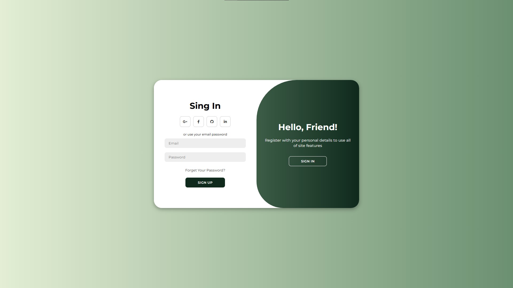

# ✨ **Página de Login Animada**

**Status do Projeto**: ✔️ Finalizado  
**Última atualização:** 28/11/2024  

## **Índice**
- [Visão Geral](#visão-geral)  
- [Funcionalidades](#funcionalidades)  
- [Tecnologias Utilizadas](#tecnologias-utilizadas)  
- [Como Visualizar o Projeto](#como-visualizar-o-projeto)  
- [Estrutura de Arquivos](#estrutura-de-arquivos)  
- [Contribuição](#contribuição)  
- [Licença](#licença)  

---

## **Visão Geral**

Este projeto demonstra como usar **HTML, CSS e JavaScript modernos** para criar uma página de login completa e interativa. Ele inclui animações de login e inscrição, explorando:  
- **CSS Flexbox** para layouts responsivos.  
- **Transições CSS** para efeitos de animação suaves.  
- **Quadros-chave CSS** para animações detalhadas e elegantes.  

A página combina usabilidade e design contemporâneo, ideal para práticas de autenticação em aplicações modernas.  



---

## **Funcionalidades**
- ✨ Animações suaves de transição entre login e inscrição.  
- 🔒 Design de formulário moderno e otimizado para usabilidade.  
- 📱 Responsividade: ajusta-se a diferentes dispositivos.  
- 🖋️ Uso de quadros-chave CSS para animações personalizadas.  

---

## **Tecnologias Utilizadas**
- **HTML5**: Estrutura do conteúdo.  
- **CSS3**: Estilos, animações com quadros-chave e Flexbox para layout.  
- **JavaScript (ES6+)**: Interatividade e lógica entre os formulários de login e inscrição.  

---

## **Como Visualizar o Projeto**

### **Passos** 
1. Clone o repositório:  
   ```bash
   git clone https://github.com/pkcosta843/projeto002.git
